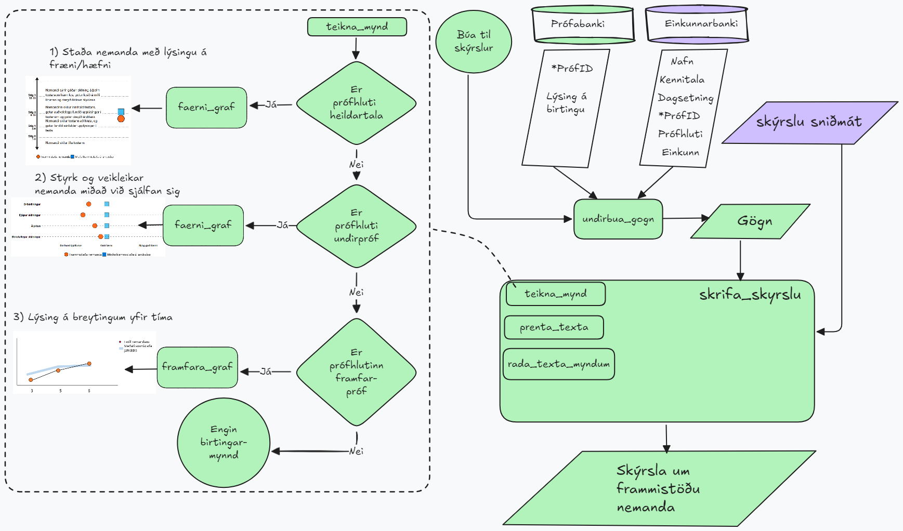

<!-- README.md is generated from README.Rmd. Please edit that file -->

```{r, include = FALSE}
knitr::opts_chunk$set(
  collapse = TRUE,
  comment = "#>",
  fig.path = "man/figures/README-",
  out.width = "100%"
)
```

# birtir

<!-- badges: start -->

<!-- badges: end -->

Megin tilgangur með `birti` er að búa til myndir, töflur og skýrslur fyrir einkunnir nemenda. Birti má bæði nota til þess að búa til einstakar myndir og töflur en einnig til þess að hnýta saman skýrslur.

Hér má sjá grunnmynd á virkni `birtis` hugmyndin er enn í þróun svo myndin getur breyst.



## Installation

You can install the development version of birtir from [GitHub](https://github.com/) with:

``` r
# install.packages("pak")
pak::pak("auv2/birtir")
```

## Dæmi um notkun

This is a basic example which shows you how to solve a common problem:

```{r example}
library(birtir)


data <- tibble::tibble(
  kennitala = "310200-3257",
  nafn_nemanda = "Grettir Ásmundsson",
  prof_numer = "les07",
  dagsetnings_profs = "2025-03-17",
  profhluti = c(
    "Heildartala", "Orðskilningur",
    "Djúpur skilningur", "Ályktun",
    "Bókstaflegur skilningur"
  ),
  einkunn = c(8, 7, 7, 9, 8)
)

summary(data)
```
