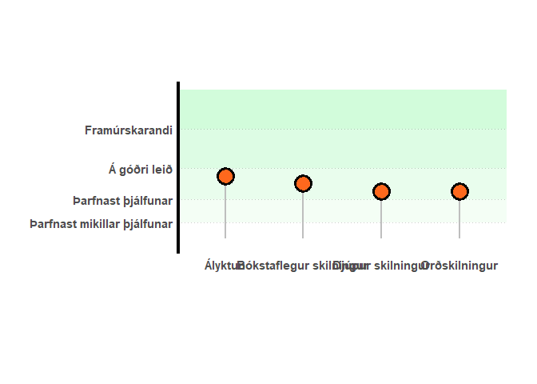

<!-- README.md is generated from README.Rmd. Please edit that file -->

# birtir

<!-- badges: start -->
<!-- badges: end -->

Megin tilgangur með `birti` er að búa til myndir, töflur og skýrslur
fyrir einkunnir nemenda. Birti má bæði nota til þess að búa til
einstakar myndir og töflur en einnig til þess að hnýta saman skýrslur.

Hér má sjá grunnmynd á virkni `birtis` hugmyndin er enn í þróun svo
myndin getur breyst.


## Installation

You can install the development version of birtir from
[GitHub](https://github.com/) with:

``` r
# install.packages("pak")
pak::pak("auv2/birtir")
```

## Dæmi um notkun

This is a basic example which shows you how to solve a common problem:

``` r
library(birtir)

# Dæmi um gögn
fa_heildartolu <- function(data, talal) {
  tibble::tibble(
    kennitala = "310200-3257",
    nafn_nemanda = "Grettir Ásmundsson",
    prof_numer = "les07",
    dagsetnings_profs = "2025-03-17",
    profhluti = c(
      "Heildartala", "Orðskilningur",
      "Djúpur skilningur", "Ályktun",
      "Bókstaflegur skilningur"
    ),
    einkunn = c(talal, 7, 7, 9, 8)
  )

}

# Dæmi um kvarða

umsogn <- c(
  "Nemandi skilur illa textann. \n",
  "Nemandi skilur textann að hluta, og getur fundið einfaldar upplýsingar  í texta. \n\n",
  "Nemandinn skilur innihald textans, getur auðveldlega fundið upplýsingar í textanum og getur dregið ályktanir. \n\n",
  "Nemandi sýnir góðan skilning á þeim texta sem hann les, getur lesið á milli línanna og dregið flóknar ályktanir. \n"

)

kvardi <- list(
  kvardi_bil = c(0,20),
  kvardi_lysing = tibble::tibble(
    einkunn = c(3, 6, 10, 15),
    lysing = c("Þarfnast mikillar þjálfunar",
               "Þarfnast þjálfunar",
               "Á góðri leið",
               "Framúrskarandi"),
    umsogn = factor(umsogn, levels = umsogn)
  )
)

faerni_graf(fa_heildartolu(data, 5), kvardi)
```


``` r
faerni_graf(fa_heildartolu(data, 10), kvardi)
```



``` r
faerni_graf(fa_heildartolu(data, 19), kvardi)
```


